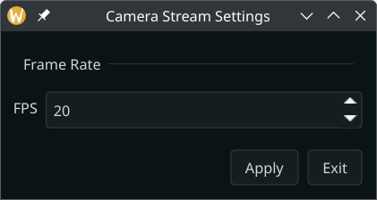
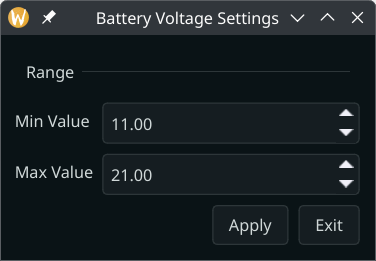
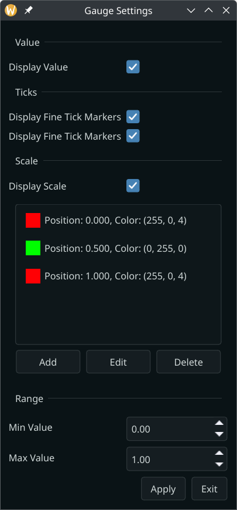
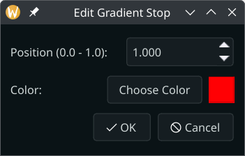
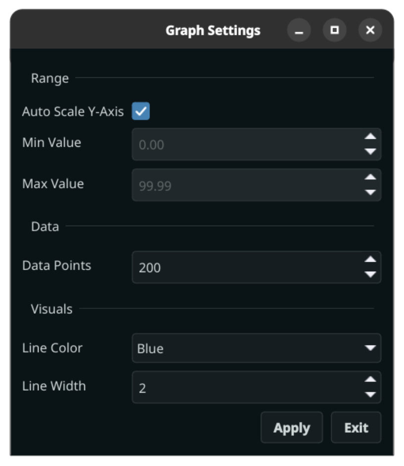
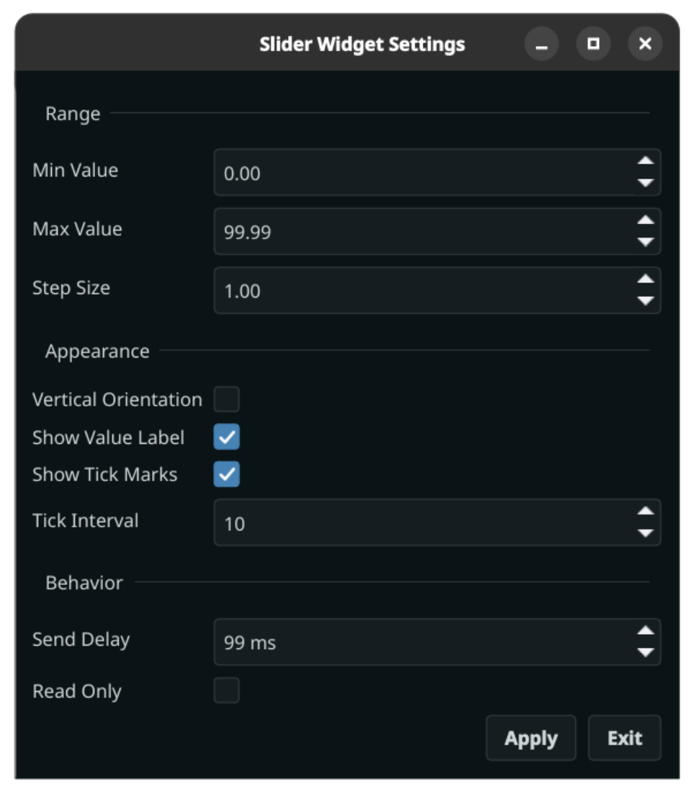

# Widgets

## Base Widget

{width=192px}
{width=192px}

This widget is used internally within KevinbotLib Dashboard.
It cannot be added from a network sendable. 
It may replace a widget in the case of an error.

## Text Widget

{width=192px}
{width=192px}

This is the most basic widget. 
It will display text from a sendable structure. 
Each dashboard structure element will be displayed in a new line.

### Compatible Data Types

* `StringSendable`
* `IntegerSendable`
* `FloatSendable`
* `BooleanSendable`
* `AnyListSendable`
* `DictSendable`
* `BinarySendable`

## Big Text Widget

{width=192px}
{width=192px}

This widget functions the same as the [Text Widget](#text-widget), but with larger text. 
The text size will automatically adjust to its content and grid span.

### Compatible Data Types

* `StringSendable`
* `IntegerSendable`
* `FloatSendable`
* `BooleanSendable`
* `AnyListSendable`
* `DictSendable`

## Editable Text Widget

{width=192px}
{width=192px}

This widget allows for the editing of text, integers, and floating-point values. 

Editing the text line will cause the widget to enter "edit mode," indicated by a red cross by the text line. 
While in edit mode, new data received will not be displayed.

Pressing the "Submit" button will repackage the last sendable received with the updated text, and send it back to the robot.
This will also exit "edit mode."

Pressing the "Cancel" button will exit "edit mode," and cause the data to reset.

### Compatible Data Types

* `StringSendable`
* `IntegerSendable`
* `FloatSendable`

## Boolean Widget

{width=192px}
{width=192px}
{width=192px}
{width=192px}

This widget can display boolean data as a colored rectangle. 
The widget will default to False/red if there is no data.

### Compatible Data Types

* `BooleanSendable`

## Color Widget

{width=192px}
{width=192px}

This widget can display color strings as a colored rectangle.

### Supported String Formats

* `#RGB` (each of R, G, and B is a single hex digit)
* `#RRGGBB`
* `#AARRGGBB`
* `#RRRGGGBBB`
* `#RRRRGGGGBBBB`
* A name from the list of colors defined in the list of SVG color keyword names provided by the World Wide Web Consortium; for example, "steelblue" or "gainsboro".
* `transparent` - representing the absence of a color.

### Compatible Data Types

* `StringSendable`

## MJPEG Streamer Widget

{width=576px}
{width=576px}

This widget can display an MJPEG stream from a video source. 
The resolution will automatically adjust as needed.

### Configuration Options

{width=280px}

The MJPEG stream allows for frame rate configuration from 1 to 20 FPS.
Reduced frame rates will improve the overall dashboard performance.

### Compatible Data Types

* `kevinbotlib.vision.MjpegStreamSendable`

## Battery Widget

{width=192px}
{width=192px}

This widget can display battery voltages in a simple and efficient graph.

### Configuration Options

{width=280px}

The graphing range can be configured in the widget's settings.

### Compatible Data Types

* `FloatSendable`

## Speedometer Widget

{width=384px}
{width=384px}

The speedometer widget can be used to display integers or floats in a highly configurable gauge.

### Configuration Options

{width=280px}

* Display Value

    This defines whether to display the large text value at the bottom of the widget.
 
* Display Fine Tick Markers

    This defines whether to display fine ticks on the gauge scale.

* Display Coarse Tick Markers

    This defines whether to display coarse ticks on the gauge scale.

* Display Scale

    This defines whether to display the colored scale on the gauge.

* Scale Gradient

    These settings change the gradient pattern displayed on the gauge.

    Clicking add or edit to add a gradient stop will open the stop editor below:
    
    {width=200px}

* Range
    
    The range options change the scale range from left-to-right.

### Compatible Data Types

* `IntegerSendable`
* `FloatSendable`

## Graph Widget

{width=384px}
{width=384px}

The graph widget can graph data with customizable properties.

### Configuration Options

{width=280px}

* Auto-Scale

    The auto-scale option will make the Y-Axis automatically scale to new values
    Settings auto-scale will disable the range options

* Range
    
    The range options will set the y-axis range.
    These options are disabled when using Auto-Scale

* Data Points

    The data points option will determine how many pieces of data are stored at any given moment.
    A higher value will increase the amount of data in the graph.

* Line Color
  
    This option sets the color of the plot.

* Line Width
  
    This option sets the width of the plot.

### Compatible Data Types

* `IntegerSendable`
* `FloatSendable`

## Slider Widget

{width=384px}
{width=384px}

The slider widget can display numeric values on a configurable slider.

### Configuration Options

{width=360px}

* Min Value

    Lowset value on the slider

* Max Value
  
    Highest number on the slider

* Step Size

    Size of each step on the slider

* Vertical Orientation

    Use a vertical slider instead of a horizontal one.

* Show Value Label
  
    Display the current value under the slider

* Show Tick Marks

    Display slider tick marks

* Tick Interval

    Interval of ticks

* Send Delay

    Delay to prevent spamming of the network while mouse is down on the slider

* Read-Only

    Prevent writing to the network

### Compatible Data Types

* `IntegerSendable`
* `FloatSendable`

## 2D Coordinate Display Widget

{width=324px}
{width=324px}
{width=324px}
{width=324px}