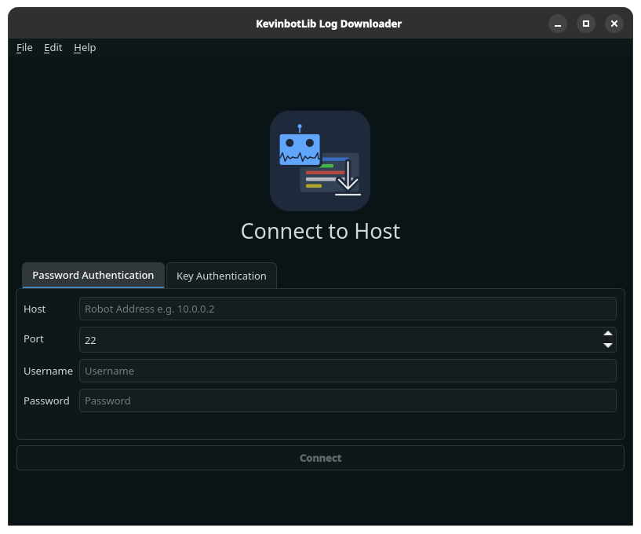
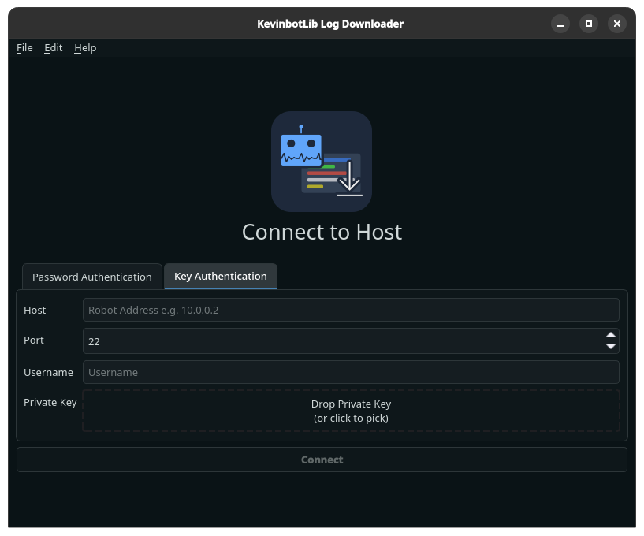
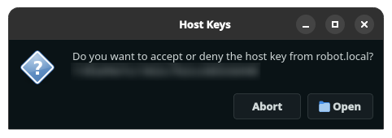

# Connecting to a Target

You may connect to a target using a password or a private RSA key file.

## Password Connection

Password-based connection requires the following information:

* Host to connect to
* SSH/SFTP Port
* Username
* Password

## Private Key Connection

Key-based connection requires the following information:

* Host to connect to
* SSH/SFTP Port
* Username
* RSA Private key file

## Host Verification

Upon connecting, you may be asked the following:

Verify that the SSH Host Key is correct before proceeding by clicking "Open." 
Click "Abort" if the Host Key isn't correct to end the connection.

Upon connecting, an index of log files will be downloaded.

!!! Tip

    Retrieving the log index will significantly slow down if there is a large number of logs stored on the robot.
    Periodically clear out logs to prevent this.