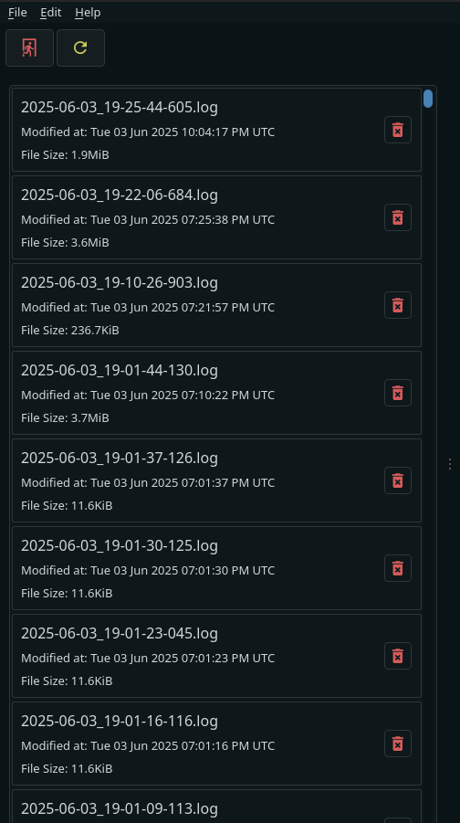

# Remote Log Controls

The log index will contain the filename, modification date, and size of each log file.

Individual files may be deleted by clicking on the trash button on each log file.

Use the red exit button to close the connection and return to the connection page.

Use the yellow refresh button to refresh the log index.

Clicking on a log will download it and open it in the [viewer](../logviewer/viewing.md).