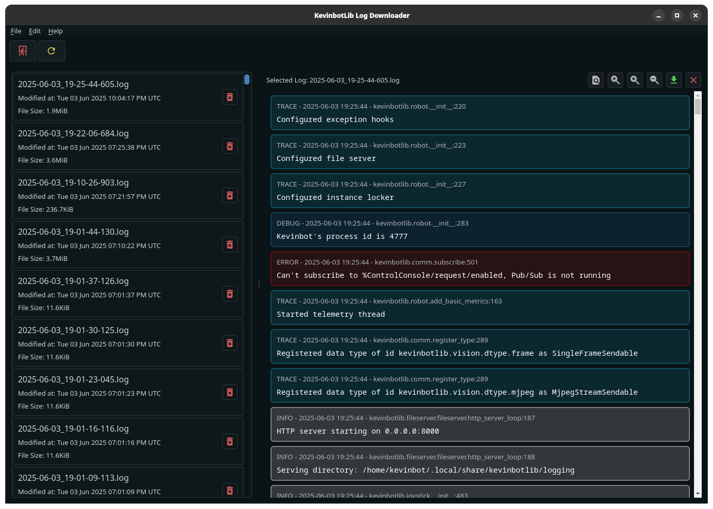

# Remote Log Viewing

KevinbotLib Log Viewer features an extensive log browser with the following features:

* Color-coded log entries
* Log level, timestamp, and entry origin
* Formatted tracebacks
* Search

## Navigation

The navigational buttons correspond to the following actions in left-to-right order:

* Find
* Zoom In
* Reset Zoom
* Zoom Out
* Download Log
* Exit to Connection Page

!!! Note
    KevinbotLib Log Downloader is powered by QtWebEngine, which is licensed under the GPLv3, and is based on Chromium.