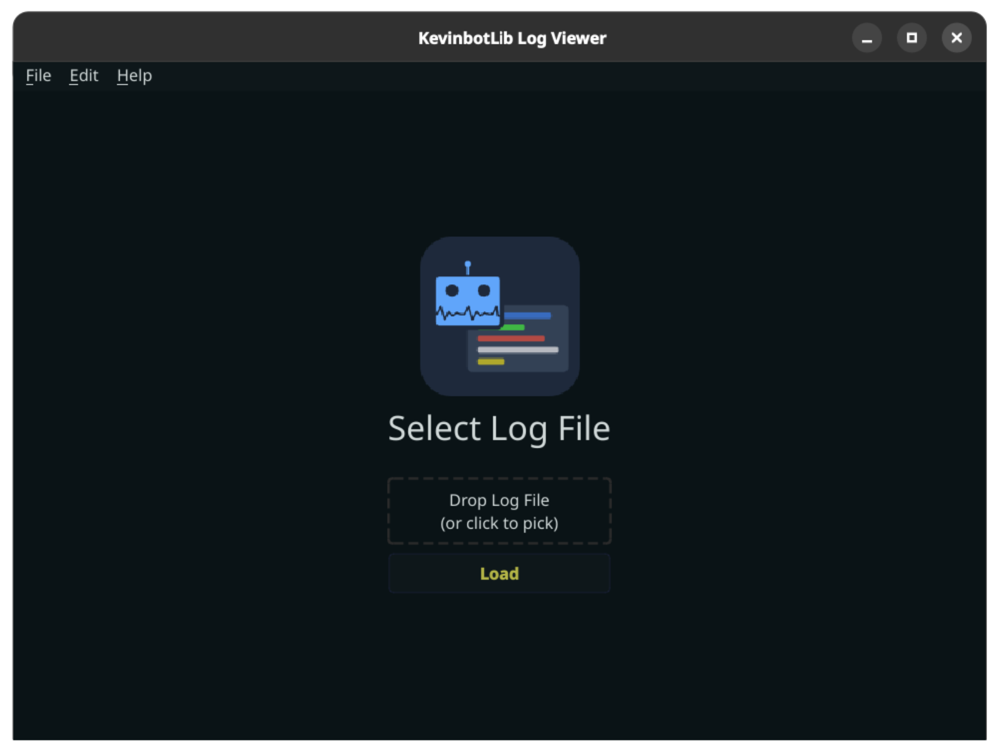
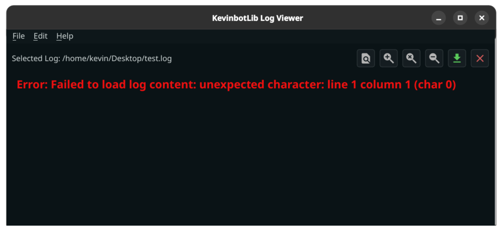

# Loading a Log

When at the main page, `.log` files can be dropped into the section labeled "Drop Log File." 
You may also click to select a file.

!!! Info
    KevinbotLib Log Viewer only supports structured logs produced by KevinbotLib 1.0.0-alpha.12 or later.
     
    A structured log can be easily identified as a plain-text file with a separate, parsable JSON serialized log entry on each line.

Clicking "Load" will load the log [to be viewed](viewing.md).

If the log file is corrupted, or is incompatible with KevinbotLib Log Viewer, you may receive the below error:

