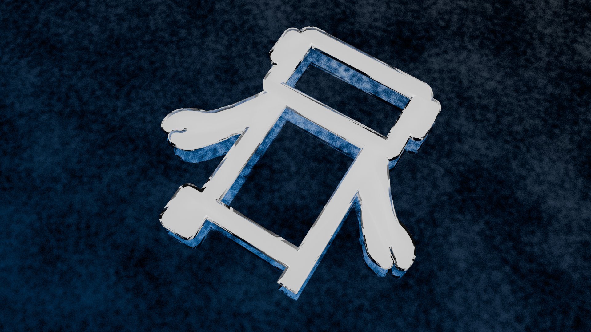

8---
date: 2025-06-06

authors:
  - kevin

categories:
  - Goals
---

# Meet KevinbotLib: The Python Robot Control System of the Future!

## What is KevinbotLib?

KevinbotLib is an advanced robot development platform for Python.
It includes many core components needed for developing robots.

## Core Features

* General Development Framework
* Simulation Framework
* Serial Hardware Interface and Controllers
* Game Controller Input Support
* Advanced Logging
* OpenCV Vision Pipeline System
* Command Scheduler
* Control Console, Dashboard, Log Viewer, and a Log Downloader

## What KevinbotLib Isn't?

1. KevinbotLib is not a code deployment system.

    > If you need a simple-to-use tool to deploy code to a remotely connected robot, checkout [KevinbotLib DeployTool](https://github.com/meowmeowahr/kevinbotlib-deploytool)

2. KevinbotLib is not a plug-and-play system (yet).

    > KevinbotLib is not ready to be used as a plug-and-play system. 
      Since it's still in Alpha, support and documentation may be limited.

## What's Next?

More hardware interfaces, better simulation support, more command-line tools, improved command scheduler support are all on the roadmap.

KevinbotLib is still in Alpha, so expect many breaking changes.

## Stay Connected

Want to try KevinbotLib or follow development?

- GitHub: [KevinbotLib Repository](https://github.com/meowmeowahr/kevinbotlib)
- Issues & Contributions: Always welcome!