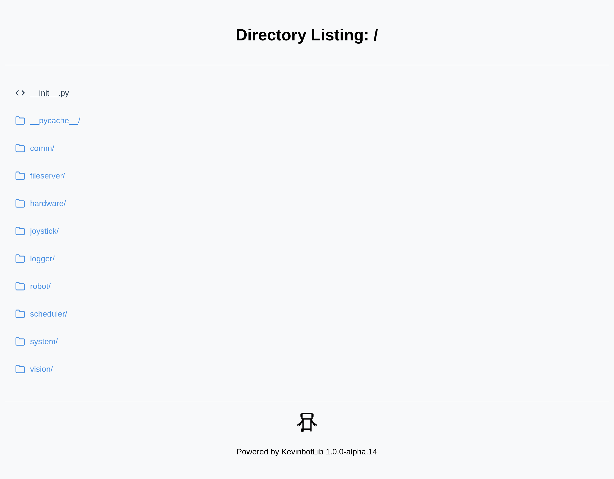

# The File Server

The KevinbotLib file server is a simple HTML/HTTP file server for KevinbotLib. 
Files and subdirectories can be served.

The KevinbotLib file server is used internally inside [The Robot Class](robot.md) to serve log files.

!!! Note
    The File server is not required to use the [KevinbotLib Log Downloader](apps/logdownloader/index.md), since that uses SFTP/SSH.

