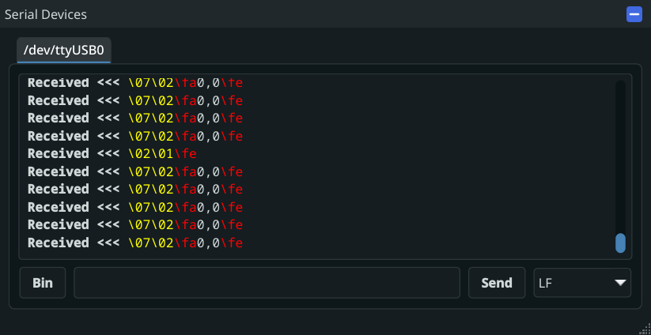
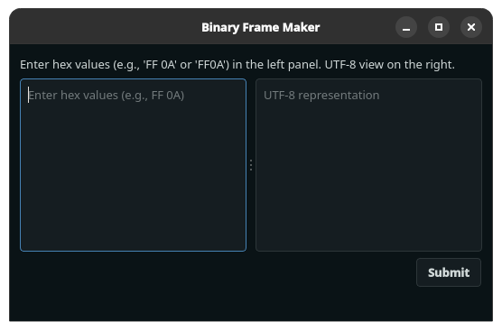
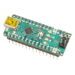

# Serial

The serial interface will connect to a local serial device.

The serial interface is capable of connection to devices with arbitrary baud-rates (may not be supported on some hardware), flow control, parity, and differing stop bits.

!!! Note
    RS-485 support has not been tested yet. Feel free to submit a GitHub issue on your findings.

## Simulation

The serial interface supports simulation via the [Kevinbot Simulation Framework](../../sim/index.md) with a built-in WindowView

!!! Info
    Providing a robot class to the interface is required to enable simulation support. 
    This can be `None` is simulation support is not needed.

{ width=500px }

The window will contain a separate tab for each "fake" serial device.

### Viewing

Data received and sent will be displayed in the main text viewer.
UTF-8 control codes (such as LF) will appear yellow. Invalid UTF-8 will appear red.

!!! Note
    RX/TX may appear to be swapped. This is because the WindowView is simulating the serial device, rather than the serial interface.

### Sending

UTF-8 encoded data can be sent be inputting text into the input line and pressing "Send."
Line endings are configurable with the dropdown menu.

To send hex-formatted data, press the "Bin" button to open a hex editor.



The left side will contain the hex input, and the right side will contain the read-only UTF-8 representation.
UTF-8 control codes (such as LF) will appear yellow. Invalid UTF-8 will appear red.

!!! Warning
    Only input hex values. Do not include invalid hex characters (such as `0x`). Spaces are ignored.

Press "Submit" to send the data. The line-ending dropdown is ignored and will not be appended.

## Examples

### Serial Hardware Query

```python title="examples/hardware/serial_query.py" linenums="1"
--8<-- "examples/hardware/serial_query.py"
```

### Serial Raw Ping/Pong

!!! example
    { align=left }

    This example requires a serial device responding to pings to be connected.

    You can make one using the [Ping Pong Test Gadget](https://github.com/meowmeowahr/kevinbotlib-test-gadgets/tree/main/pingpong)

    The test gadget can be flashed to most PlatformIO compatible devices.

```python title="examples/hardware/serial_raw_ping_pong.py" linenums="1"
--8<-- "examples/hardware/serial_raw_ping_pong.py"
```

[^1]: Arduino Nano image modified from an original image by MakeMagazinDE, licensed under CC BY-SA 4.0 ([link](https://commons.wikimedia.org/wiki/File:Arduino_nano_isometr.jpg)).