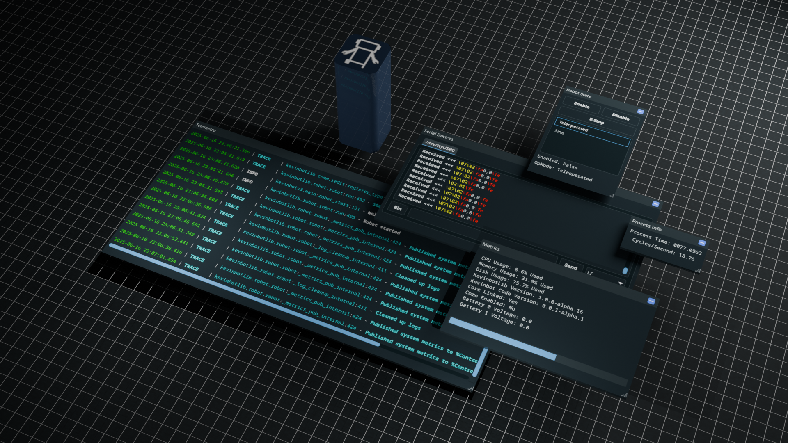

# Simulation Framework

The _KevinbotLib Simulation Framework_ allows for the testing of robot code before deployment.

## Using the Simulator Within a Robot

[`BaseRobot.run()`](../reference/robot/#kevinbotlib.robot.BaseRobot.run) will automatically detect the `--simulate` command line flag.

The simulator can be detected at runtime using the [`BaseRobot.IS_SIM`](../reference/robot/#kevinbotlib.robot.BaseRobot.IS_SIM) attribute, or if [`BaseRobot.simulator`](../reference/robot/#kevinbotlib.robot.BaseRobot.simulator) is a [`SimulationFramework`](../reference/simulator/#kevinbotlib.simulator.SimulationFramework) class.

### Examples

## See Also

[Simulation Framework Reference](../reference/simulator.md)
