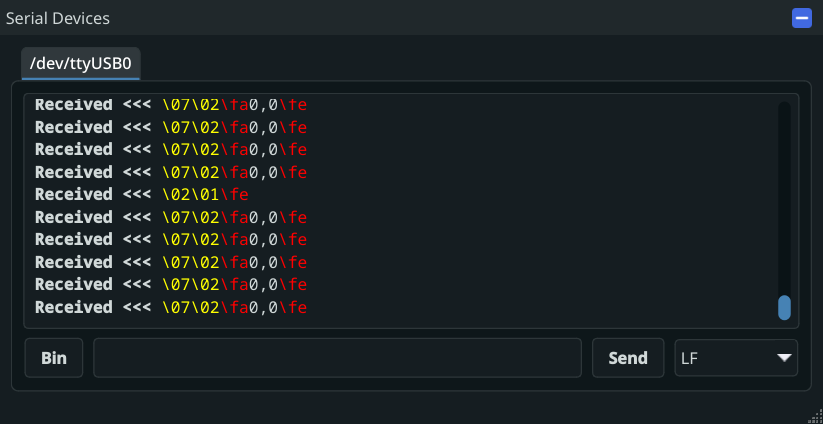

# Simulation Framework


The _KevinbotLib Simulation Framework_ allows for the testing of robot code before deployment.

## Architecture


## Built-in Simulator WindowViews

### Process Time

{ width=180px }

Display robot process running time, and robot cycle time

### Telemetry

{ width=560px }

Display logs in real-time

### Metrics

{ width=360px }

Display Robot Metrics

### Robot State

{ width=220px }

Set the current OpMode, Enable, Disable, or E-Stop the robot

## Additional Simulator WindowViews

### Serial Devices

{ width=480px }

Display each used Serial Interface in a tab

View more info [here](../hardware/interfaces/serial#simulation)

### Vision Cameras

{ width=480px }

Simulate vision cameras by using local cameras, or image uploads

View more info [here](../vision/simulation)

## Using the Simulator Within a Robot

[`BaseRobot.run()`](../reference/robot.md#kevinbotlib.robot.BaseRobot.run) will automatically detect the `--simulate` command line flag.

The simulator can be detected at runtime using the [`BaseRobot.IS_SIM`](../reference/robot.md#kevinbotlib.robot.BaseRobot.IS_SIM) attribute, or if [`BaseRobot.simulator`](../reference/robot/#kevinbotlib.robot.BaseRobot.simulator) is a [`SimulationFramework`](../reference/simulator/#kevinbotlib.simulator.SimulationFramework) class.

### Examples

Any robot that correctly extends [`BaseRobot`](../reference/robot.md#kevinbotlib.robot.BaseRobot) is capable of running the simulator by using the `--simulate` command-line flag.

```python title="examples/robot/robot.py" linenums="1"
--8<-- "examples/robot/robot.py"
```

Run

```bash
python robot.py --simulate
```

## See Also

[Simulation Framework Reference](../reference/simulator.md)
