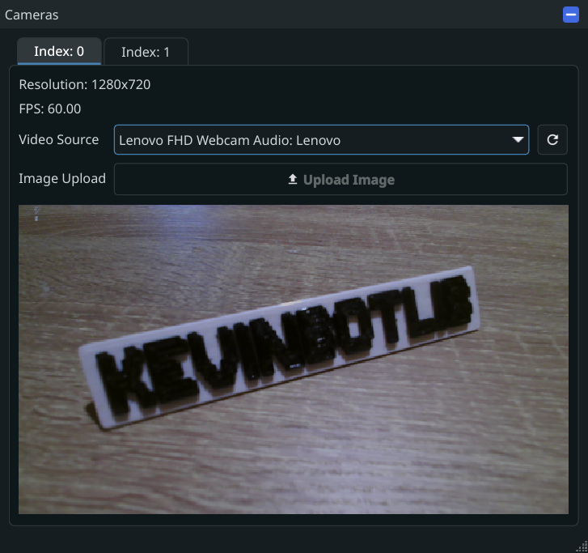
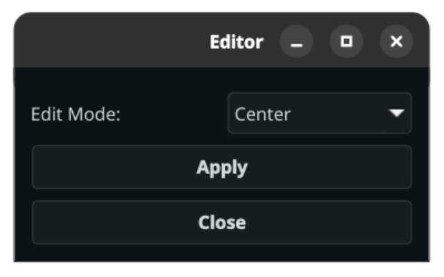

# Simulation

The BaseCamera class has support for integrating with a [Simulation Framework WindowView](../sim/windowview.md)

!!! Info
    See [Extending BaseCamera](extend-basecamera.md)

## Simulation Window

The Simulation Window consists of a tab for each of the robot's cameras.
Each tab will have independent resolution and frame rates, according to the robot configuration.

### Video Sources

Each simulated camera can connect to a physically connected camera using camera passthrough, or an uploaded image file.

!!! Note
    Camera passthrough is not currently available on macOS

!!! Warning
    A physical camera can only connect to one simulated camera, since connections aren't pooled.

### Image Upload

Image upload can be used in the "Uploaded Image" video source.

Pressing the image upload button will display a file chooser to select an image.

!!! Info
    Only PNG, JPG, JPEG, and BMP images are supported

After an image is uploaded, you may select a crop mode.

{ width=300px; }